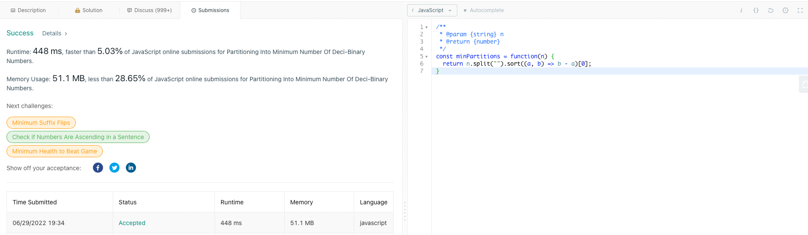

# Partitioning Into Minimum Number Of Deci-Binary Numbers

A decimal number is called **deci-binary** if each of its digits is either 0 or 1 without any leading zeros. For example, 101 and 1100 are deci-binary, while 112 and 3001 are not.

Given a string n that represents a positive decimal integer, *return the minimum number of positive deci-binary numbers needed so that they sum up to n.*

Example 1:
~~~
Input: n = "32"
Output: 3
Explanation: 10 + 11 + 11 = 32
~~~
Example 2:
~~~
Input: n = "82734"
Output: 8
~~~
Example 3:
~~~
Input: n = "27346209830709182346"
Output: 9
~~~
 
Constraints:

- 1 <= n.length <= 10^5
- n consists of only digits.
- n does not contain any leading zeros and represents a positive integer.

# Solucion:
Para encontrar la solucion a este problema utilizare cuatro pasos:

* Paso 1: Comprender el problema.
* Paso 2: Crear un plan paso a paso sobre cómo se va a resolver.
* Paso 3: Ejecutar el plan y escribir el código real.
* Paso 4: Revisar y de ser necesario modificar la solucion.

## Paso 1: Comprender el problema

- *¿Qué tipo de entrada recibe la funcion?* 
  * Recibe una secuencia de caracteres que representa un numero entero positivo.
- *¿Qué devuelve la función?* 
  * Devuelve un entero que representa el numero de deci-binary que se necesitan para sumar los digitos de la entrada.
- *¿Que es un deci-binary?* La descripción de "deci-binary" es bastante sencilla:
  * Un numero decimal es deci-binary si cada uno de sus digitos es 0 o 1.
  * Por ejemplo, 101 y 1100 son deci-binary, mientras que 112 y 3001 no lo son.
  * Sin ceros a la izquierda/no comienza con un cero en Deci-Binary.

Ahora, lo que se solicita es encontrar *"... el número mínimo de números **deci-binary** positivos necesarios para que sumen n".*

* n es el número que nos dan como una cadena de caracteres.
* n debe estar formado por estos números **deci-binary**
* Estos se ven así 101, 1100, etc…
* Lo que se quiere es devolver la menor cantidad de estos números!

Lo siguiente que se debe hacer es investigar los ejemplos para entender mejor el problema.

Example 1:
~~~
Input: n = "32"
Output: 3
Explanation: 10 + 11 + 11 = 32
~~~
Example 2:
~~~
Input: n = "82734"
Output: 8
~~~
Example 3:
~~~
Input: n = "27346209830709182346"
Output: 9
~~~

Analizando los ejemplos anteriores, parece que la regla o patron es que el número más grande de la cadena es el que se devuelve.

## Paso 2: Crear un plan paso a paso sobre cómo se va a resolver.

Para resolver este problema seguire los siguientes pasos:

1. Convertir el string en una lista de caracteres. (Los duplicados del número mayor no parecen importar)
2. Ordernar la lista de caracteres de mayor a menor.
3. Devolver el primer elemento de la lista de caracteres.

## Paso 3: Ejecutar el plan y escribir el código real.

Se puede utilizar los metodos .split() para convertir el string en una lista de caracteres y .sort() para ordernar la lista de caracteres de mayor a menor. Despues se devuelve el primer elemento de la lista.

~~~
const minPartitions = function(n) {
  return n.split("").sort((a, b) => b - a)[0];
}
~~~

## Paso 4: Revisar y de ser necesario modificar la solucion.

La solucion es aceptada por la plataforma LeetCode.

